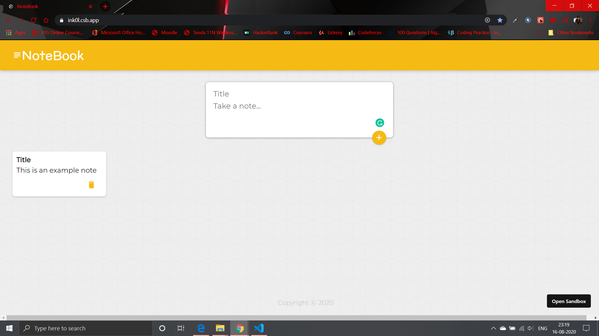

# [NoteBook](http://bit.ly/note12book)
Created with **React.Js**

## Components
* Header
* Note
* Footer

## Add Note
* Create a constant using useState object that keeps track of title and constant
* Pass the new note to App
* Add new note to array
* Take an array and render seperate Note components using map function for each item

## Delete Note
* Callback from the Note component to trigger a delete function
* Use filter function to filter out the item that needs deletion
* Pass an id over to the Note Component, pass it back to the App when deleting